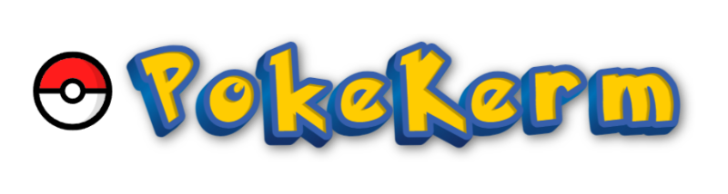

<!-- PROJECT LOGO -->
 

  

<h3 align="center">PokeKerm</h3>

  

    An online PokeDex for first generation Pokemon using the PokeAPI. Built with React/Bootstrap stack and hosted on Netlify.
     
    <a href="https://github.com/KermWasTaken/poke-kerm"><strong>Explore the docs »</strong></a>
     
     
    <a href="https://poke.kerm.dev">View The PokeDex</a>
    ·
    <a href="https://github.com/KermWasTaken/poke-kerm/issues">Report Bug</a>
    ·
    <a href="https://github.com/KermWasTaken/poke-kerm/issues">Request Feature</a>
  

[![MIT][license-shield]][license-url]
[![LinkedIn][linkedin-shield]][linkedin-url]
[![Netlify Status][netlify-shield]][netlify-shield-url]

<!-- TABLE OF CONTENTS -->

  
Table of Contents

  <ol>
    <li>
      <a href="#about-the-project">About The Project</a>
      <ul>
        <li><a href="#built-with">Built With</a></li>
      </ul>
    </li>
    <li><a href="#license">License</a></li>
    <li><a href="#contact">Contact</a></li>
    <li><a href="#acknowledgments">Acknowledgments</a></li>
  </ol>

<!-- ABOUT THE PROJECT -->

## About The Project

[![Kerm.dev Screen Shot][site-screenshot]](https://kerm.dev)

I made this project following an unfinished ["React mock inteview"][video-link] Youtube video by [DonTheDeveloper][channel-link]. I wanted to apply React skills I had learn to see if I could finish what the video start. This project is the result.

(<a href="#readme-top">back to top</a>)

### Built With

- [![React][React.js]][React-url]
- [![Bootstrap CSS][Bootstrap]][Bootstrap-url]
- [![Host][Netlify]][Netlify-url]

(<a href="#readme-top">back to top</a>)

<!-- LICENSE -->

## License

Distributed under the MIT License. See `LICENSE.txt` for more information.

(<a href="#readme-top">back to top</a>)

<!-- CONTACT -->

## Contact

Zak Kermitz - zakkermitz@gmail.com

Project Link: [https://poke.kerm.dev](https://poke.kerm.dev)

(<a href="#readme-top">back to top</a>)

<!-- ACKNOWLEDGMENTS -->

## Acknowledgments

- [Front End Mock Technical Interview | JavaScript, CSS, React, and Algorithms][video-link] by [DonTheDeveloper][channel-link]
- [Pokemon 3D text | Text Effect Generator | TextStudio](https://www.textstudio.com/logo/pokemon-3d-text-318)

(<a href="#readme-top">back to top</a>)

<!-- MARKDOWN LINKS & IMAGES -->
<!-- https://www.markdownguide.org/basic-syntax/#reference-style-links -->

[license-shield]: https://img.shields.io/github/license/KermWasTaken/poke-kerm?
[license-url]: https://github.com/KermWasTaken/poke-kerm/blob/main/LICENSE
[linkedin-shield]: https://img.shields.io/badge/-LinkedIn-black.svg?logo=linkedin&colorB=555
[linkedin-url]: https://linkedin.com/in/zacharykermitz
[netlify-shield]: https://api.netlify.com/api/v1/badges/b60ace1c-72eb-4845-9452-54da4155bd41/deploy-status
[netlify-shield-url]: https://app.netlify.com/sites/pokekerm/deploys
[site-screenshot]: src/assets/pokekermSite.png
[video-link]: https://www.youtube.com/watch?v=vomuCMmoNyE
[channel-link]: https://www.youtube.com/@DonTheDeveloper
[React.js]: https://img.shields.io/badge/React-20232A?style=for-the-badge&logo=react&logoColor=61DAFB
[React-url]: https://reactjs.org/
[Bootstrap]: https://img.shields.io/badge/bootstrap-%238511FA.svg?style=for-the-badge&logo=bootstrap&logoColor=white
[Bootstrap-url]: https://getbootstrap.com/
[Netlify]: https://img.shields.io/badge/netlify-%23000000.svg?style=for-the-badge&logo=netlify&logoColor=#00C7B7
[Netlify-url]: https://www.netlify.com/
